> **योजना साथी** — Government Welfare Scheme Eligibility Engine

A full-stack platform that bridges Indian citizens with welfare schemes. Submit a single profile and instantly discover which of 4,702+ central and state schemes you qualify for — ranked by value, with missing-document detection and auto-drafted application letters.

| Statistic | |
|-----------|-|
| ⚡ Schemes | 4,702 across 8 categories |
| 🗄️ Database | 7 PostgreSQL tables |
| 📡 API | 18 endpoints |
| 🔐 RLS | 22 policies |

---

## 🚀 Quick Navigation

| Page | Description |
|------|-------------|
| [🏗️ Architecture](Architecture) | System design, data flow, 5-agent pipeline |
| [⚙️ Setup](Setup) | Local development in 10 minutes |
| [📡 API Reference](API-Reference) | All 18 endpoints with examples |
| [🗄️ Database Schema](Database-Schema) | 7 tables, indexes, functions, triggers |
| [🔒 Security](Security) | Auth, RLS, sanitization, rate limiting |
| [🚀 Deployment](Deployment) | Render + Vercel + Supabase |

---

## ✨ Key Features

**🎯 Deterministic Eligibility** — 100% rules-based engine. Age, income, occupation, social category, disability, state, gender. No black-box decisions, reproducible results every time.

**📊 Intelligent Ranking** — Schemes ranked by estimated benefit value with tie-breaking by category priority. Near-boundary penalties surface "close" matches for manual review.

**📋 Document Gap Analysis** — Compares scheme requirements against your verified documents. Shows exactly what's missing — no guesswork.

**🤖 LLM-Assisted Drafting** — One-click formal application letter generation. Optional Groq-powered language polish with graceful degradation when LLM is unavailable.

**📄 OCR Document Upload** — Upload Aadhaar, income certificates, and more. OCR extracts data with confidence scoring.

**🔄 Automated Re-matching** — Supabase Edge Functions trigger re-evaluation when your profile or scheme rules change.

**🔐 Row-Level Security** — Every user-data table scoped via \uth.uid() = user_id\. Service-role access for internal operations only.

**💬 Chat Assistant** — Ask questions about schemes, eligibility, or application status. Groq-powered with graceful fallback.

---

## 🛠️ Tech Stack

| Tier | Technology |
|------|-----------|
| **Frontend** | Next.js 16, React 19, TypeScript 5, Tailwind CSS 4, GSAP 3 |
| **Backend** | FastAPI, Python 3.12, Pydantic, structlog, Groq SDK |
| **Database** | PostgreSQL 15 (Supabase), uuid-ossp, GIN indexes |
| **Auth** | Supabase Auth (JWT, HS256 + ES256) |
| **Edge** | Deno (Supabase Edge Functions) |
| **Hosting** | Render (Docker), Vercel (Next.js) |
| **Monitoring** | Sentry, structlog JSON |

---

## 📂 Project Structure

---

## 📖 Next Steps

| | Page |
|-|------|
| 🏗️ | [Architecture →](Architecture) |
| ⚙️ | [Setup Guide →](Setup) |
| 📡 | [API Reference →](API-Reference) |
| 🔒 | [Security →](Security) |
| 🚀 | [Deployment →](Deployment) |
